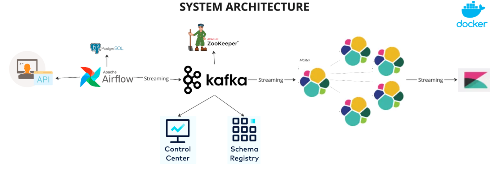

# Kafka & Airflow

[Apache Kafka](https://kafka.apache.org/)

# LinkdIn 개발

<aside>
💡 카프카는 데이터 파이프라인(Data Pipeline)을 구축할 때 가장 많이 고려되는 시스템 중 하나로 링크드인에서 처음 개발된 분산 메시징 플랫폼이며 오픈소스입니다.

끊임없이 들어오는 데이터를 일괄적으로 묶어서 데이터를 처리하고 실시간으로 데이터를 처리하거나 가공하여 또 다른 서비스에 데이터를 전달하여 IoT 데이터 처리, 금융거래 사기방지 등에 사용됩니다. 

뿐만 아니라 오픈마켓에서 사용자의 홈페이지 클릭 수, 상품을 바라보는 빈도 및 시간, 주문 및 환불 서비스 등 어플리케이션 사용자의 활동 분석을 통해 기업에서 전략적으로 비즈니스를 할 수 있도록 데이터를 수집/분석하는 데도 사용됩니다.

현재는 링크드인에서 카프카를 개발하던 일부 엔지니어들이 '[Confluent](https://www.confluent.io/)'라는 회사를 설립하여 카프카와 관련된 일을 하고 있습니다.

</aside>

- 트위터 : 사용자에게 트윗을 보내고 받을 때 사용
- 링크드인: 이용자의 사이트 활동 데이터를 분석 및 운영하는 데 사용
- 넷플릭스: 실시간 모니터링 및 이벤트 처리를 위해 사용
- 모질라 파이어폭스: 최종 사용자 브라우저에서 성능 및 사용 데이터를 수집

---

# 2024-03-20

# 카프카 도커로 실행

VSCode에서 yml 파일 작성

- **kafka-compose.yml**
    
    ```yaml
    version: '1'
    services:
      zookeeper:
        image: wurstmeister/zookeeper:latest
        container_name: zookeeper
        ports:
          - "2181:2181"
      kafka:
        image: wurstmeister/kafka:latest
        container_name: kafka
        ports:
          - "9092:9092"
        environment:
          KAFKA_ADVERTISED_HOST_NAME: 127.0.0.1
          KAFKA_ZOOKEEPER_CONNECT: zookeeper:2181
        volumes:
          - /var/run/docker.sock:/var/run/docker.sock
    ```
    

- **터미널에서 아래 코드 실행**
    
    ```bash
    $ docker compose -f kafka-compose.yml up
    $ docker exec -it kafka /bin/bash
    $ cd /opt/kafka
    
    # Topic 생성
    ./bin/kafka-topics.sh --create --bootstrap-server localhost:9092 --topic fisa-kafka-test
    
    # Topic 생성 - partitions, replication-factor
    ./bin/kafka-topics.sh --create --bootstrap-server localhost:9092 --topic fisa-kafka-test --partitions 1 --replication-factor 1
    
    # Topic 설정 변경
    # 확장은 가능하지만 축소는 불가능
    ./bin/kafka-topics.sh --bootstrap-server localhost:9092 --topic fisa-kafka-test --alter --partitions 10
    
    # Topic 확인
    ./bin/kafka-topics.sh --describe --bootstrap-server localhost:9092 --topic fisa-kafka-test
    
    # Topic 목록
    ./bin/kafka-topics.sh --list --bootstrap-server localhost:9092
    
    # Topic 삭제
    ./bin/kafka-topics.sh --delete --bootstrap-server localhost:9092 --topic fisa-kafka-test
    
    # Producer
    ./bin/kafka-console-producer.sh --bootstrap-server localhost:9092 --topic fisa-kafka-test
    
    # Producer - Key, Value
    ./bin/kafka-console-producer.sh --bootstrap-server localhost:9092 --topic fisa-kafka-test --property "parse.key=true" --property "key.separator=:" --property "print.key=true"
    ./bin/kafka-console-producer.sh --bootstrap-server localhost:9092 --topic test-topic --property "parse.key=true" --property "key.separator=:" --property "print.key=true"
    
    # Producer - Message
    ABCDE
    # Producer - Key, Value Message
    key:{"val1":"A","val2":"B","val3":3}
    key1:value1
    key2:value2
    key3:value3
    
    # Consumer
    ./bin/kafka-console-consumer.sh --bootstrap-server localhost:9092 --topic fisa-kafka-test --from-beginning
    
    # Consumer Group 확인
    ./bin/kafka-consumer-groups.sh --list --bootstrap-server localhost:9092
    
    # Cousumer Group 생성
    ./bin/kafka-console-consumer.sh --bootstrap-server localhost:9092 --topic test-topic --group test-group --from-beginning --max-messages 1
    
    # Consumer Group Topic 확인
    ./bin/kafka-consumer-groups.sh --describe --bootstrap-server localhost:9092 --topic fisa-kafka-test --group test-group
    
    # Topic 생성시 오류가 나는 경우
    ./bin/kafka-topics.sh --create --bootstrap-server localhost:9092 --command-config client.properties --replication-factor 3 --partitions 1 --topic not-working-topic
    ```
    

---

# 2024-03-22

---

# 2024-03-25

# AirFlow

- Flask 기반의 Workflow Management platform, Workflow는 DAG로 표시된다.



<aside>
💡 ETL: Extract, Transform and Load

- Extract : 소스를 사용해서 데이터 덤프로부터 데이터를 받아오는 작업들
- Transform : 데이터의 형태 및 포맷을 바꾸는 것, 경우에 따라서 이 과정 생략 가능
- Load: 데이터 웨어하우스에서 테이블 형태로 적재 혹은 레이크에 적재
</aside>

<aside>
💡 ETL vs ELT

- ETL: 데이터를 데이터 웨어하우스 외부에서 내부로 가져오는 프로세스
- ELT: 데이터 웨어하우스 내부 데이터를 조작해서 (보통은 좀더 추상화
되고 요약된) 새로운 데이터를 만드는 프로세스
▪ 이 경우 데이터 레이크(DW보다 Scalable)를 쓰기도 함
</aside>

## Airflow 설치 및 실행하기

## 가. Ubuntu 환경에서 Docker로 설치 및 실행

[Running Airflow in Docker — Airflow Documentation](https://airflow.apache.org/docs/apache-airflow/stable/howto/docker-compose/index.html)

```bash
$ ubuntu
$ mkdir airflow
$ cd airflow
$ curl -LfO 'https://airflow.apache.org/docs/apache-airflow/2.8.3/docker-compose.yaml'
$ mkdir -p ./dags ./logs ./plugins ./config
$ echo AIRFLOW_UID=50000 > .env
$ docker compose up airflow-init
$ docker compose up
```

## 나. 수업에서 사용할 Airflow

https://github.com/YeonjiKim0316/airflow_test

## 다. EC2에 airflow 설치 및 설정

1. AIRFLOW는 최소 4gb 메모리와 10GB의 여유공간을 필요로 합니다. t2.large / 20GB로 EC2를 생성하고 docker를 설치해주세요.
2. 인바운드 규칙은 아래와 같습니다
    
    
    

## 참고: EC2에 Docker 설치하기

현재 우리의 EC2 환경은 텅 비어있는 것이나 다름없기 때문에, `sudo apt-get update` 로 설치 가능한 패키지 리스트를 불러온 후, Docker 등 필요한 패키지를 설치해야 합니다. 

- Ubuntu는 apt, CentOS(AWS AMI)는 yum 명령어를 사용합니다. 운영체제에 맞는 명령어를 사용하세요.

### 1) 우분투 시스템 패키지 업데이트

```bash
$ sudo apt-get update
$ curl https://get.docker.com/ | sudo sh  # 도커 설치
```

- 위 명령어가 작동하지 않을 경우?
    
    ### 2) 필요한 패키지 설치
    
    ```bash
    sudo apt-get install apt-transport-https ca-certificates curl gnupg-agent software-properties-common
    ```
    
    ### 3) Docker의 공식 GPG키를 추가
    
    ```bash
    curl -fsSL https://download.docker.com/linux/ubuntu/gpg | sudo apt-key add -
    ```
    
    ### 4) Docker의 공식 apt 저장소를 추가
    
    ```bash
    sudo add-apt-repository "deb [arch=amd64] https://download.docker.com/linux/ubuntu $(lsb_release -cs) stable"
    ```
    
    ### 5) Docker 설치
    
    ```bash
    sudo apt-get install docker-ce docker-ce-cli containerd.io
    ```
    

### 6) Docker 설치 확인하기

- 도커 실행상태 확인

```bash
sudo docker ps
```

- 도커 실행

```
sudo docker compose up
```

### 참고: sudo 없이 docker명령어 사용하기

**1. 현재 사용자를 docker group에 포함**

> sudo usermod -aG docker ${USER}
> 

**2. 터미널 재시작 후 결과 확인(도커가 등록되어 있는지 확인)**

> id -nG
> 

- 실습: 터미널에서 간단한 도커 내부 코드 변경하기
    
    ```bash
    sudo docker exec -it {컨테이너이름} /bin/bash
    
    apt-get update
    apt-get install vim
    vi 파일명
    ```
    

## python 코드 예시

```python
from airflow import DAG
from airflow.decorators import task
from datetime import datetime

@task
def print_hello():
    print("hello!")
    return "hello!"

@task
def print_goodbye():
    print("goodbye!")
    return "goodbye!"

with DAG(
    dag_id = 'HelloWorld_v2',
    start_date = datetime(2023,8,15),
    catchup=False,
    tags=['example'],
    schedule = '0 2 * * *'
) as dag:

    # Assign the tasks to the DAG in order
    print_hello() >> print_goodbye()

```

## 데이터 파이프라인의 입력과 출력을 명확히 문서화

- 비지니스 오너를 명시 : 누가 이 데이터를 요청했는지를 기록으로 남겨야 편해집니다.

<aside>
💡 **데이터 리니지**(데이터 계보)
현재 쓰이는 데이터가 어떻게 생성됐고, 어떤 과정을 거쳤으며, 어디에 쓰이고 있는지 등의 계보를 관리해 현황을 파악하는 프로세스를 의미합니다. (데이터 사용에 대한 로그 수집)

</aside>

## **DM**(Data Mart), **DW**(Data Warehouse), **DL**(Data Lake)

[데이터 레이크, 데이터 웨어하우스, 데이터 마트 비교 - 클라우드 스토리지 솔루션 간의 차이점 - AWS](https://aws.amazon.com/ko/compare/the-difference-between-a-data-warehouse-data-lake-and-data-mart/)

- **DM**: 활용할 형태로 데이터를 쌓아두는 공간
- **DW**: DM에 공급할 데이터를 여러 곳에서 수집하고, ETL을 사용해 주제별로 통합 및 저장하는 공간
- **DL:** 수집한 데이터를 다양한 형태 그대로 한 곳에 저장하는 공간
    - DW에는 필요한 데이터만 유지하고 이전 데이터를 DL(또는 저장소)로 이동


# Airflow MySQL 연결

- **Admin → Connections**
    
    
    
- **Add a new record**
    
    
    
- **MySQL 정보 입력 후 저장**
    
    
    
- **python 코드**
    
    ```python
    # aws 테이블 확인
    from datetime import datetime, timedelta
    from email.policy import default
    from textwrap import dedent
    
    from airflow import DAG
    from airflow.providers.mysql.operators.mysql import MySqlOperator
    
    default_args = {
        'depends_on_past': False,
        'retires': 1,
        'retry_delay': timedelta(minutes=5)
    }
    
    sql_create_table = """
        CREATE TABLE `employees` (
            `employeeNumber` int(11) NOT NULL,
            `lastName` varchar(50) NOT NULL,
            `firstName` varchar(50) NOT NULL,
            `extension` varchar(10) NOT NULL,
            `email` varchar(100) NOT NULL,
            `officeCode` varchar(10) NOT NULL,
            `reportsTo` int(11) DEFAULT NULL,
            `jobTitle` varchar(50) NOT NULL,
        PRIMARY KEY (`employeeNumber`)
        );
    """
    
    sql_insert_data = """
        insert  into `employees`(`employeeNumber`,`lastName`,`firstName`,`extension`,`email`,`officeCode`,`reportsTo`,`jobTitle`) values 
            (1002,'Murphy','Diane','x5800','dmurphy@classicmodelcars.com','1',NULL,'President'),
            (1056,'Patterson','Mary','x4611','mpatterso@classicmodelcars.com','1',1002,'VP Sales'),
            (1076,'Firrelli','Jeff','x9273','jfirrelli@classicmodelcars.com','1',1002,'VP Marketing'),
            (1088,'Patterson','William','x4871','wpatterson@classicmodelcars.com','6',1056,'Sales Manager (APAC)'),
            (1102,'Bondur','Gerard','x5408','gbondur@classicmodelcars.com','4',1056,'Sale Manager (EMEA)'),
            (1143,'Bow','Anthony','x5428','abow@classicmodelcars.com','1',1056,'Sales Manager (NA)'),
            (1165,'Jennings','Leslie','x3291','ljennings@classicmodelcars.com','1',1143,'Sales Rep'),
            (1166,'Thompson','Leslie','x4065','lthompson@classicmodelcars.com','1',1143,'Sales Rep'),
            (1188,'Firrelli','Julie','x2173','jfirrelli@classicmodelcars.com','2',1143,'Sales Rep'),
            (1216,'Patterson','Steve','x4334','spatterson@classicmodelcars.com','2',1143,'Sales Rep'),
            (1286,'Tseng','Foon Yue','x2248','ftseng@classicmodelcars.com','3',1143,'Sales Rep'),
            (1323,'Vanauf','George','x4102','gvanauf@classicmodelcars.com','3',1143,'Sales Rep'),
            (1337,'Bondur','Loui','x6493','lbondur@classicmodelcars.com','4',1102,'Sales Rep'),
            (1370,'Hernandez','Gerard','x2028','ghernande@classicmodelcars.com','4',1102,'Sales Rep'),
            (1401,'Castillo','Pamela','x2759','pcastillo@classicmodelcars.com','4',1102,'Sales Rep'),
            (1501,'Bott','Larry','x2311','lbott@classicmodelcars.com','7',1102,'Sales Rep'),
            (1504,'Jones','Barry','x102','bjones@classicmodelcars.com','7',1102,'Sales Rep'),
            (1611,'Fixter','Andy','x101','afixter@classicmodelcars.com','6',1088,'Sales Rep'),
            (1612,'Marsh','Peter','x102','pmarsh@classicmodelcars.com','6',1088,'Sales Rep'),
            (1619,'King','Tom','x103','tking@classicmodelcars.com','6',1088,'Sales Rep'),
            (1621,'Nishi','Mami','x101','mnishi@classicmodelcars.com','5',1056,'Sales Rep'),
            (1625,'Kato','Yoshimi','x102','ykato@classicmodelcars.com','5',1621,'Sales Rep'),
            (1702,'Gerard','Martin','x2312','mgerard@classicmodelcars.com','4',1102,'Sales Rep');
    """
    
    with DAG(
        'MySQL_operator',
        default_args = default_args,
        description = """
            1) 'employees' 테이블을 DB에 생성
            2) 'employees' 테이블에 값 넣기
        """,
        schedule_interval = '@daily',
        start_date = datetime(2022, 1, 1),
        catchup = False,
        tags = ['mysql', 'AWS', 'test', 'employees']
    ) as dag:
        t1 = MySqlOperator(
            task_id="create_employees_table",
            mysql_conn_id="AWS_RDB",
            sql=sql_create_table,
        )
    
        t2 = MySqlOperator(
            task_id="insert_employees_data",
            mysql_conn_id="AWS_RDB",  # Connections에 등록한 이름을 사용 
            sql=sql_insert_data
        )
    
        t1 >> t2
    ```
    

---

# 2024-03-26

## AIRFLOW는 최소 4gb 메모리와 10GB의 여유공간이 필요

## Airflow API Json 형식으로 보기

http://localhost:8080/api/v1/dags/task-relationship

http://localhost:8080/api/v1/dags/task-relationship/tasks
